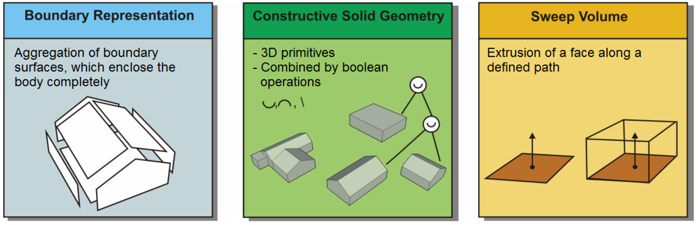
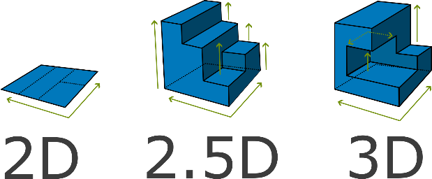

== Current capabilities

=== GeoSPARQL

GeoSPARQL is the most common geospatial extension of SPARQL. It was accepted as an OGC standard in 2012 and revised as GeoSPARQL 1.1 in 2024.

According to the standard document, "The OGC GeoSPARQL standard supports representing and querying geospatial data on the Semantic Web. GeoSPARQL defines a vocabulary for representing geospatial data in RDF, and it defines an extension to the SPARQL query language for processing geospatial data".

==== Requirements addressed

In order to define which capabilities GeoSPARQL needs to adopt for full 3D compatibility, we first take a look at GeoSPARQL 1.1 current capabilities with regards to 3D.

===== Dimensionality

In this white paper, when we discuss three dimensional data, we mean three dimensional geometries; instances of the class https://docs.ogc.org/is/22-047r1/22-047r1.html#_84414e8b-8ccc-407d-85b0-f3b474bba54d[geo:Geometry]. GeoSPARQL 1.1 defines three different properties for geometry that have to do with dimensionality:

1. https://docs.ogc.org/is/22-047r1/22-047r1.html#_property_geodimension[geo:dimension], or __topological dimension__: This is the number of perpendicalar directions in which a geometry extends. A point, for example, extends in no direction, so its topological dimension is 0. A line has a length, but no width or height. Its topological dimension is 1. A cube has a topological dimension of 3.

2. https://docs.ogc.org/is/22-047r1/22-047r1.html#_property_geocoordinatedimension[geo:coordinateDimension]:
In the geometric model that GeoSPARQL uses, points are the basic building blocks of geometry. A point geometry can have a different number of coordinates, depending on the space in which it is placed. A point on a flat map, or on the surface of a sphere, needs two coordinates. The __coordinate dimension__ is the number of coordinates in the points that define a Geometry. 

3. https://docs.ogc.org/is/22-047r1/22-047r1.html#_property_geospatialdimension[geo:spatialDimension]:
In order to support linear referencing, geometries in GeoSPARQL can have a measure value. This is a relative position along a line or a curve, and does not extend the Geometry in space. The __spatial dimension__, therefore, can be used to denote the number of coordinates in a point, excluding the measurement value.

The extended capabilities for GeoSPARQL discussed in this white paper concern the cases where the _spatial dimension_ (wich can be expressed with property https://docs.ogc.org/is/22-047r1/22-047r1.html#_property_geospatialdimension[geo:spatialDimension]) of geometry has the value 3.

The table below shows the values of the three dimension properties for some Geometries (expressed as Well Known Text (WKT)).

|=== 
| Geometry (WKT) | geo:dimension | geo:coordinateDimension | geo:spatialDimension 

| point (4 15) | 0 | 2 | 2 
| point Z (4 15 3) | 0 | 3 | 3 
| linestring (4 15, 13 2) | 1 | 2 | 2
| point M (4 15 60) | 0 | 3 | 2
| point ZM (4 15 3 60) | 0 | 4 | 3
|=== 

===== Vocabulary
GeoSPARQL version 1.1 consists of a Core module, a Topology Vocabulary extension, a Geometry extension, a Geometry Topology extension, an RDFS Entailment extension, and a Query Rewrite extension.
Each of these modules will be briefly explained below.

===== Core Module
GeoSPARQL version 1.1 includes a CORE module. This defines the basic classes, relationships, and literals. These classes are suitable for both 2D and 3D.

====== Topology Vocabulary Extension
This extension provides standard definitions for spatial relationships that can exist between one spatial object and another. 

Relations between geometries have been defined using three different sets of rules:

- Simple Features Relations
- Egenhofer Relations
- Region Connection Calculus RCC8

These topological definitions specify topological relations in a 2D-context.

====== Geometry Extension
GeoSPARQL 1.1 geometry module defines a class `Geometry` as a subclass of `SpatialObject`.

An instance of `Geometry` is not restricted to two dimensions.  

A fine-grained classification of `Geometry` can use the https://opengeospatial.github.io/ogc-geosparql/geosparql11/sf_geometries.ttl[Simple Feature Vocabulary] which extends the class `Geometry` with further types, such as _Point_, _Polygon_ etc.

The Simple Features vocabulary allows for the definition of 3D variants of:

- (Multi)Points
- (Multi)LineStrings
- (Multi)Polygons
- Polyhedralsurface

It does not include commons 3D primitives, such as _Cube_ or _Mesh_ surfaces which are integral parts of 3D representations. Nor does it include extruded geometry.  

[#img_3dinifc,reftext='{figure-caption} {counter:figure-num}']
.Possible approaches for representing 3D objects in IFC

Concerning metadata of 3D models, GeoSPARQL 1.1 provides properties which can be reused in 3D contexts.
In particular, the properties are:

- `geo:hasVolume`
- `geo:hasMetricVolume`

Further 3D-related metadata properties such as projection matrices are not part of the current GeoSPARQL 1.1 standard.

A first requirement for 3D support is the ability to save 3D data in a knowledge graph.

The Geometry extension enables geometries to be defined within the GeoSPARQL framework. Supported geometry formats include RDF literals in WKT, GML, GeoJSON, and KML.

These literals are investigated for the storage of 3D data.

[#img_dimensions,reftext='{figure-caption} {counter:figure-num}']
.Difference between 2D, 2.5D and 3D geometry

[cols="3,3,3,3"] 
|=== 
|Literal Type | Z-Coordinate Supported | 2.5D | 3D 
|WKT Literal  | Yes | Yes | Yes
|GML Literal  | Yes | Yes | Only with extension Schema
|KML Literal  | Yes | Yes | As import from COLLADA
|GeoJSON Literal  | Yes | Yes | Yes
|DGGS Literal  |  |  | 
|=== 

GeoSPARQL 1.1 also does not restrict the usage of coordinate reference systems with 3D support.
There are currently almost 300 coordinate reference systems in the database https://epsg.io/?q=%20kind%3AGEOG3DCRS[epsg.io] which can be used to describe 3D data encoded in the GeoSPARQL graph literals listed above.

 GeoSPARQL allready supports linking multiple geometries (e.g., 2D and 2.5D) to a single feature. We aim to extend this with 3D geometries. 

 For example, a tree in the real world may be represented in databases with both a 2D and a 3D geometry.

 This should not require duplication of the tree entity — there can be one tree instance with both geometries linked, avoiding redundancy in the data model.

===== Query functions with 3D support

GeoSPARQL 1.1 functions currently do not offer fully-featured 3D support. 
However, there are functions which may take into account the Z coordinate, if they are available.

[cols="3,3,3,3"] 
|=== 
|GeoSPARQL function | Z-Coordinate Supported | 2.5D | 3D 
|geof:is3D  | Yes | Yes | Yes
|geof:minZ  | Yes | Yes | Yes
|geof:maxZ  | Yes | Yes | Yes 
|=== 

These functions check for the presence of Z coordinates or filter out maximum and minimum Z coordinates of the given geometry.

===== Geometry Topology Extension
Another extension is the Geometry Topology extension. This provides query functions that return relationships between different geometries based on the topology vocabulary extension.

===== RDFS Entailment Extension
The RDFS Entailment extension provides rules for reasoning over geometries. Based on specific statements, additional information can be inferred.
This kind of logical inference can also be applied to geometry. GeoSPARQL includes logic for reasoning over simple features geometries.

===== Query Rewrite Extension
GeoSPARQL allows queries such as whether “Feature A” is located within “Feature B” using its vocabulary. The Query Rewrite extension specifies a RIF rule that enables query rewriting. However, this extension does not support the rewriting of 3D queries.
