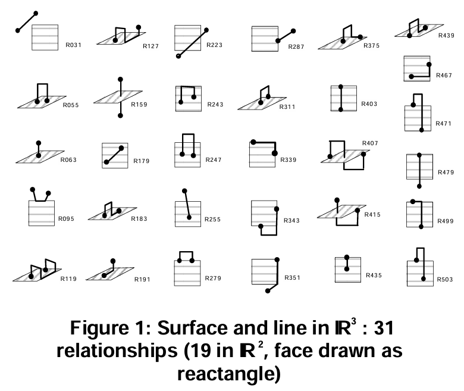
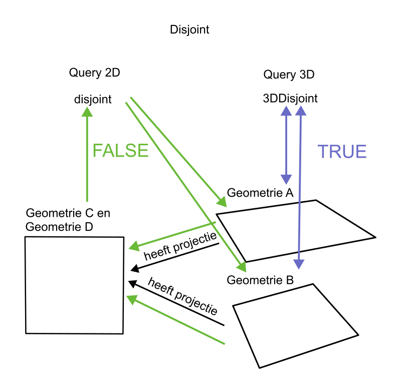

== Requirements for GeoSPARQL 3D

=== 5.1 Existing implementation of 3D geometry in GeoSPARQL
This section provides an overview of feedback received on the current version of the GeoSPARQL standard (version 1.1) regarding 3D usage. 
It helps to identify some of the barriers to use, and to outline requirements that have not been addressed that may encourage greater uptake.

==== Proposed extensions for GeoSPARQL 3D

===== Extension {counter:ext}: 3D representations

====== GitHub Issue URI

https://github.com/opengeospatial/ogc-geosparql/issues/583

====== Category

Semantic improvement

====== Description

GeoSPARQL primarily focuses on spatial representation and querying rather than visualization, formats such as glTF and 3D Tiles could provide a complementary representation and delivery mechanism for the resulting 3D data. GeoSPARQL should include ways to represent 3D data in a knowledge graph. 3D data should be included in common 3D formats and 3D data should be includable as a text literal and a file representation. Where 3D data is intended for web-based visualization, formats should preferably be selected that are well supported by commonly used JavaScript and web-mapping libraries. This would facilitate the visualization and delivery of 3D knowledge-graph data on the web and help establish a practical bridge between BIM and GIS, enabling 3D information originating from BIM to be queried, linked, and visualized together with geospatial data.

Some common formats which could be considered for inclusion are:

- https://paulbourke.net/dataformats/ply/[Polygon File Format (PLY)]
- https://www.loc.gov/preservation/digital/formats/fdd/fdd000507.shtml[Wavefront OBJ Format (OBJ)]
- https://registry.khronos.org/glTF/specs/2.0/glTF-2.0.html[GLTF Format (GLTF)]
- https://www.web3d.org[X3D Format]
- https://openusd.org/dev/spec.html[openUSD]

===== Extension {counter:ext}: Topological relations of 3D geometries

====== GitHub Issue URI

https://github.com/opengeospatial/ogc-geosparql/issues/416
https://github.com/opengeospatial/ogc-geosparql/issues/581 
https://github.com/opengeospatial/ogc-geosparql/issues/595

====== Category

Semantic improvement

====== Description

GeoSPARQL should include ways to represent relations between 3D geometries and relations between 3D geometries and geometries of lower dimensions.
The relations should be expressable in property relations and should be queryable using SPARQL extension functions.

- Topological relations in 3D 

The topological possibilities in a 3D space differ from those in 2D space. The mathematical formulations 
used to verify topological relationships in 2D are different from those required in 3D. Furthermore, the algorithms 
used to analyze topological relationships also differ, as the sequence of analyses needed to identify 
and evaluate these relationships is not the same in two- and three-dimensional space. 
As a result, topological analysis in 3D requires a fundamentally different approach from that used in 2D.

The example below illustrates the differences in the possible topological relationships in two- and three-dimensional space for surfaces and lines.
All relationships drawn in (2D) exist in both 2D and 3D environments. The relationships illustrated in 3D can only exist in a true 3D environment.
It should be noted that not all theoretically possible topological relationships have been assigned a descriptive name. 
Some relationships are identified only by a numerical identifier within the underlying topological model and therefore cannot be queried directly using named predicates 
(such as Disjoint, Intersects, or Contains). Investigating which of these unnamed relationships are relevant and should be exposed as explicit query operators 
in a 3D environment could be an interesting direction for future research.

[#img_Topological_relations,reftext='{figure-caption} {counter:figure-num}']
.Surface and line topological relations in 2D and 3D space

Disjoint (R031)
Inside (R223)
Touch (R287, R279)
Covers (R439, R435)
Crosses (R159, R243, R247, R255)
Equal (R403, R407, R415)
CoveredBy (R467, R471, R479)
Contains (R179, R183, R191)
Overlaps (R499, R503)
Nameless topological situation (R127, R375, R055, R063, R339, R095, R343, R119, R351)

The semantic definition of a topological relationship, for example disjoint, is identical in both two- and three-dimensional spaces, 
the outcome of a disjoint function depends on the space in which the geometries are evaluated.

A Query3D evaluates the topological relationship directly in the original three-dimensional Euclidean space. 
In contrast, a Query2D first projects the geometries onto a two-dimensional plane and subsequently evaluates 
the topological relationship in this projected space. Consequently, a Query2D does not determine whether 
two 3D geometries are disjoint in 3D space, but whether their 2D projections are disjoint in 2D space.

As a result, the same pair of geometries may produce different outcomes depending on whether they are evaluated 
using Query2D or Query3D. Two objects may be disjoint in three-dimensional space while their projections overlap, 
causing Query3D to return true for Disjoint and Query2D to return false.

[#img_Disjoint,reftext='{figure-caption} {counter:figure-num}']
.Disjoint with Query2D and Query3D functions

The example assumes that both geometries are in the same dimension (2D). 
It is also common to analyze the topological relationship between a geometries of differt dimensions 0D, 1D, 2D or 3D. 
Such comparisons require both geometries to be represented in the same spatial dimension before a meaningful topological analysis can be performed.

This can be achieved in one of two ways:

- embedding the 2D geometry into 3D space; or
- projecting the 3D geometry into 2D space.

It is recommended that these transformations are performed explicitly and with a consciously selected Z-value.

For example, when ST_Force3D is applied to a 2D geometry, most implementations automatically assign a Z-coordinate of 0, 
thereby producing a valid 3D geometry. This default value does not necessarily indicate that the geometry is actually 
located at an elevation of zero. The value merely serves as a placeholder to satisfy the requirements of a three-dimensional 
coordinate system. After conversion, it is no longer possible to distinguish whether a Z-value of 0 originated from the source 
data or was automatically introduced during the conversion process. For applications in which elevation is meaningful, 
this ambiguity may lead to incorrect interpretations or topological analyses. Explicitly specifying the Z-value during the 
conversion makes this modeling decision transparent and reproducible.

When a Query2D is requested for geometries that exist only as 3D objects without an explicitly defined projection, 
the system should indicate that the question is not directly applicable. Instead, it should require the user to specify 
or confirm the projection to be used before performing the topological evaluation. This would make the dimensional c
ontext explicit and help prevent misinterpretation of the query results.

===== Extension {counter:ext}: Directional relations of 3D geometries

====== GitHub Issue URI

none

====== Category

Semantic improvement

====== Description

Topological relations describe the relationships between objects independently of perspective. 
Relative directional relations, on the other hand, describe relationships between objects that depend on a reference frame or viewpoint. 
Directional relationships distinguishes different perspectives 
- viewer-centered, deictic perspective (1 constellation, 2 observers results in 2 spatial relationships)
- object-centered, intrisic perspective (object orientation as reference frame)
- extrinsic, external perspective (universal reference systems like gravity vector, coordinate systems, axes, linear reference elements)

In 2D, relations such as left of, above, and beside are often sufficient. In 3D, additional relations become relevant, such as above/below and in front of/behind.

Relative directional relations can also provide context in 2D, but many spatial situations can already be described using topology (e.g., inside, touching, overlapping). 
In 3D environments, however, directional relations become more important because height and depth introduce additional dimensions that cannot be distinguished by topology alone.

For example, describing that a "damage location is underneath a bridge deck" requires both a topological relation (e.g., a 3D contains relation) 
and a relative directional relation (e.g., below).

This combination of relative location and topological relations has been described by Anne Göbels and Jakob Beetz in the Reloc ontology. https://annegoebels.github.io/reloc/[Reloc ontology].

This ontology brings natural language closer to the 3D model by formalizing descriptions of relative directions and topological relationships.

==== Proposed extensions for GeoSPARQL 3D

===== Extension {counter:ext}: Routing

====== GitHub Issue URI

https://github.com/opengeospatial/ogc-geosparql/issues/572

====== Category

Semantic improvement

====== Description

GeoSPARQL should be able to query for the shortest route through a 3D space made up of smaller, connected 3D spaces when topological relations are not available. 
By enabling this, GeoSPARQL can describe spatial data and where features are located, while also supporting analysis/description of how things can move between them. By deriving connections between 3D objects(spaces) using their geometry and openings, GeoSPARQL could support shortest-path and accessibility analysis without requiring all topological relationships to be explicitly modelled. This could be useful for applications such as emergency evacuation, indoor navigation, fire compartmentation and safety analysis, accessibility assessment, and analysing potential pathways for smoke or fire spread.

===== Extension {counter:ext}: Appearance of 3D geometries

====== GitHub Issue URI

- https://github.com/opengeospatial/ogc-geosparql/issues/584
- https://github.com/opengeospatial/ogc-geosparql/issues/592

====== Category

Semantic improvement

====== Description

GeoSPARQL should include ways to represent materials and textures of 3D geometries, so that geometries can be styled accordingly.

Materials include:

- Colors of surfaces with light diffusion parameters
- Images as textures, which are associated with surfaces of the 3D object

The main purpose is not to make GeoSPARQL a visualisation format, but to allow existing rich 3D formats to retain their textures, colours and materials while their geometries can still be queried and analysed spatially. Visualisation is then one possible application of this information. This could also enable queries based on material or texture information, allowing users to combine spatial and material information. For example, a user could query: “Find all features within this area that contain lead.” Visualisation is then one possible application of this information, while material-based spatial analysis provides additional possibilities for applications such as building safety, renovation, and environmental risk assessment.

===== Extension {counter:ext}: Multi-component 3D geometries

====== GitHub Issue URI

https://github.com/opengeospatial/ogc-geosparql/issues/591

====== Category

Semantic improvement

====== Description

GeoSPARQL should include ways to define multi-component 3D geometries, whereas each component expresses its own semantics.
For example, parts of a building could have different semantics according to the function of the building components and would be classified as such in an RDF graph.

Existing standards such as IFC, CityGML, SML already provide mechanisms for decomposing 3D objects into 3D parts. GeoSPARQL could build on these existing relationships, allowing the geometries of individual components to be queried and analysed together with their semantics. This would enable queries that combine spatial and semantic information, for example, identifying all building components within a specific area that are made of lead, or finding all walls that are part of a particular building and intersect a given spatial region.

===== Extension {counter:ext}: Positioning of 3D geometries

====== GitHub Issue URI

- https://github.com/opengeospatial/ogc-geosparql/issues/587
- https://github.com/opengeospatial/ogc-geosparql/issues/588
- https://github.com/opengeospatial/ogc-geosparql/issues/589
- https://github.com/opengeospatial/ogc-geosparql/issues/591

====== Category

Semantic improvement

====== Description

GeoSPARQL should include ways to position 3D geometries in a 3D space.
Commonly 3D geometries are rotated, translated and scaled using commonly defined operators in computer graphics.
Similar operations are needed for the relative positioning of 3D objects in GeoSPARQL, as properties and potentially as functions. 

===== Extension {counter:ext}: Alignments of GeoSPARQL 3D

====== GitHub Issue URI

- https://github.com/opengeospatial/ogc-geosparql/issues/590
- https://github.com/opengeospatial/ogc-geosparql/issues/574
- https://github.com/opengeospatial/ogc-geosparql/issues/571

====== Category

Semantic improvement

====== Description

GeoSPARQL 3D should be aligned to other vocabularies and standard which currently provide 3D support in different knowledge domains.
Especially alignments to https://technical.buildingsmart.org/standards/ifc/ifc-formats/ifcowl/[ifcOWL] and the https://www.web3d.org/x3d/content/semantics/semantics.html[X3D vocabulary] would position the GeoSPARQL vocabulary as a link between these different standards.

===== Extension {counter:ext}: Alignments of Engineering CRS to Geospatial CRS

====== GitHub Issue URI

https://github.com/opengeospatial/ogc-geosparql/issues/586

====== Category

Semantic improvement

====== Description

GeoSPARQL 3D should provide the opportunity to align a local coordinate system in which most 3D geometries are defined with a coordinate reference.
While this work might only be partially done within the scope of GeoSPARQL itself, GeoSPARQL should be aligned with the emerging https://github.com/opengeospatial/ontology-crs[Ontology CRS] developments of OGC and provide necessary functions or properties to create the link. 

===== Extension {counter:ext}: Geometry Extrusion

====== GitHub Issue URI

- https://github.com/opengeospatial/ogc-geosparql/issues/556
- https://github.com/opengeospatial/ogc-geosparql/issues/547

====== Category

Semantic improvement

====== Description

GeoSPARQL 3D should provide the opportunity to extrude 2D geometries to 3D geometries and vice versa.

===== Extension {counter:ext}: Geometry Attributes

====== GitHub Issue URI

- https://github.com/opengeospatial/ogc-geosparql/issues/568
- https://github.com/opengeospatial/ogc-geosparql/issues/550
- https://github.com/opengeospatial/ogc-geosparql/issues/549
- https://github.com/opengeospatial/ogc-geosparql/issues/548
- https://github.com/opengeospatial/ogc-geosparql/issues/558

====== Category

Semantic improvement

====== Description

GeoSPARQL 3D should provide functions and properties that describe essential properties of a 3D Geometry such as its minimum and maximum height, width and depth and its CompactnessRatio.

===== Extension {counter:ext}: Non-topological Query Functions - 3D Extension

====== GitHub Issue URI

- https://github.com/opengeospatial/ogc-geosparql/issues/556

====== Category

Semantic improvement

====== Description

GeoSPARQL 3D should provide the opportunity to execute non-topological query functions on 2D and 3D geometries commonly used in geospatial databases. Proposed extensions include following functions:

- geometry extrusion to the specified line segment
- geometry extrusion to the specified height
- spatiotemporal geometry extrusion to the specified line segment with specific start and end time

===== Extension {counter:ext}: 3D Geometry available in Open BIM (IFC)

====== GitHub Issue URI

https://github.com/opengeospatial/ogc-geosparql/issues/8
https://github.com/opengeospatial/ogc-geosparql/issues/574
https://github.com/opengeospatial/ogc-geosparql/issues/590
https://github.com/opengeospatial/ogc-geosparql/issues/582
https://github.com/opengeospatial/ogc-geosparql/issues/598
https://github.com/opengeospatial/ogc-geosparql/issues/588
https://github.com/opengeospatial/ogc-geosparql/issues/608

====== Category

Semantic improvement

====== Description

When using GeoSPARQL with OPEN BIM (IFC), the geometry can either be used directly from the IFC format (natively) or converted to a GeoSPARQL-compatible format. A converter can be used as an intermediate layer, but this introduces several drawbacks:
- Additional complexity: an extra component must be maintained.
- Performance overhead: geometries need to be extracted and converted.
- Synchronization issues: IFC changes require the converted geometry to be regenerated.
- Loss of geometric information: IFC can contain richer 3D geometry than formats such as WKT can represent.
- Converter dependency: the quality and supported geometry types depend on the conversion tool.

IFC is a standard with a rich set of geometric primitives, with core concepts defined in the geometry, presentation, material, topology and profile resource subschemas. But also outside of these modules, there are various concepts that have geometrical implications such as openings and space boundary relationships in the productextension subschema. The listing <<#AnnexCOverviewOfIFCGeometry, Annex C: Overview of IFC Geometry>> tries to provide a comprehensive overview broken down per the categories below:

- Relational; typically IfcRelationship between elements subtypes, but also clearance geometry which is a potential additional shape representation identifier
- Product-level; resources applicable the IfcProduct such as material-based styling; openings
- Item-level; the individual items that make up representation of the element; which are in turn potentially affected by product-level features such as openings and styling
- Context; provides additional information on individual items such as precision, target scale and semantic use of the geometry
- Geo-referencing;
Prevalence is measured as a text-based scan through a set of 1000 files (500 for novel constructs). The number indicates percentage of model featuring this entity; and then the average number of instances for those models that contain any. See second table for more details.

A questionnaire was conducted to identify which types of geometry different stakeholders would like to have available.

=== 5.3 Vanilla 3D geometry handling in the Semantic Web
This section describes in what other ways 3D geometry is currently handled in the Semantic Web, for example in BOT ontology, OMG and FOG ontologies, and few more.

=== 5.4 Concluding overview of requirements for 3D geometry in the semantic web
A concluding summary with a list of requirements to be taken into account for future development in different places and organisations.

